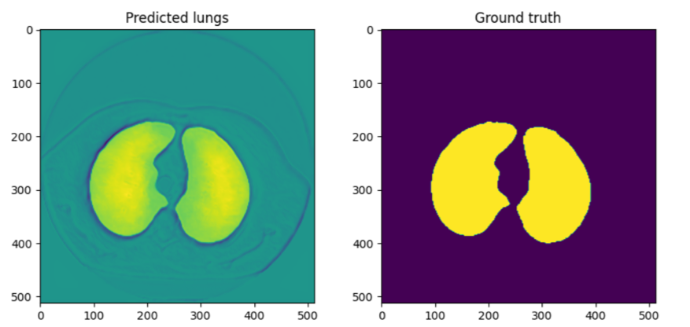
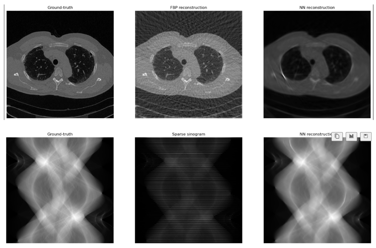
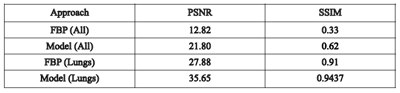

# Compressed sensing for Computed Tomography using Deep Learning

Team:

Andrey Galichin\
Evgeny Gurov\
Arkadiy Vladimirov

## Prerequisites

This is the `Python` implementation of the final project on Skoltech university MSc Deep Learning 2023 course "Deep Learning-based sinogram reconstruction for compressed sensing in Computed Tomography".

In our work, we propose to train the neural network (UNet-like with SE-ResNeXt50 backbone, in our case) to reconstruct a full projection sinogram from a sparse one from CT Chest scans. As a unique approach we propose to calculate the reconstruction loss on the images reconstructed from our sinograms using standard **Filtered back-projection (FBP)** algorithm. The reconstruction loss, however, is calculated only on the pixels that correspond to the lungs of a chest on the slice. For this case, we also train a seperate UNet network on a small segmentation dataset. The main network is trained and evaluated on [**COVID-19**](https://www.kaggle.com/c/osic-pulmonary-fibrosis-progression) dataset.

To sum up, the overall pipeline is presented in the following picture:

## Results

Results of the segmentation network:

Results of our reconstruction network:

**PSNR** and **SSIM** metrics calculated for test images (for base **FBP** reconstruction and with our model):

Here, *All* means the metrics are calculated on the whole image, *lungs* means that metrics are calculated only on pixels corresponding to lungs.

## Team member's contributions

* Andrey Galichin:
  - Reviewing literature on the topic
  - Coding main pipeline
  - Github Repo Support
* Evgeny Gurov:
  - Coding pipeline for Segmentation
  - Presentation design
* Arkadiy Vladimirov:
  - Reviewing literature on the topic
  - Performing experiments
  - Presentation design 
